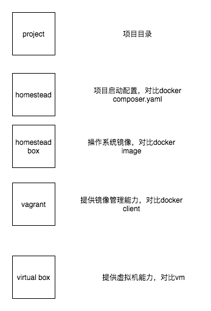

# Homestead


## what



安装virtual box  提供虚拟能力

安装vagrant 客户端提供vagrant box 管理能力

安装vagrant box 提供操作系统的能力  

安装homestead  官方配置

安装项目，同步文件并启动


## Virtual Box

可选择安装virtual box 或者vm，vm扩展需要收费  这里安装virtual box  安装过程参考官方

## Vagrant

vagrant客户端，提供box 启动销毁更新等一系列能力安装件官方

## Homestead Box

可以把Homestead Box 理解成集成了nginx  mysql pgsql  php-version ssh vim等等包的iso镜像,homestead box 基于Ubuntu的，也可以自己基于centos构建自己的镜像

直接官方安装太慢，建议先下载box文件，在本地安装

解压之后一般会有metadata文件，没有的话需要手动添加镜像

```bash
#vagrant box add metadata.json
```

## Homestead

github克隆Homestead

修改Homestead.yaml文件，这个文件包含了共享文件目录，数据库，ssh pub-key，内存，cpu核数,ip地址

1 配置独立的ssh  key

2 共享目录建议只映射必要的目录

3 ip地址需要修改hosts

4 多个站点可以配置多核站点映射，最终都将生成nginx配置


## 这套东西可以干啥


1 解决懒人配置，homestead box提供了大部分能想到的镜像能力，免去了每次都需要配置包依赖，各种工具的安装

2 分离项目代码和开发环境，代码可以主机目录和虚拟机目录同步，数据库，日志这些都可以预先设置，开发环境的销毁重建不会影响到已有数据

3 开发环境一致，解决协作之间由环境不一致引发的bug,开发即测试，测试即灰度，灰度及生产。有新的需求建立开发环境可以直接分享Homestead的配置，也支持个性化的定制配置


## 替代方案

docker image +  docker composer编排配置  基本无差，docker国内生态比较完善，下载安装速度比较快，资源比较多


